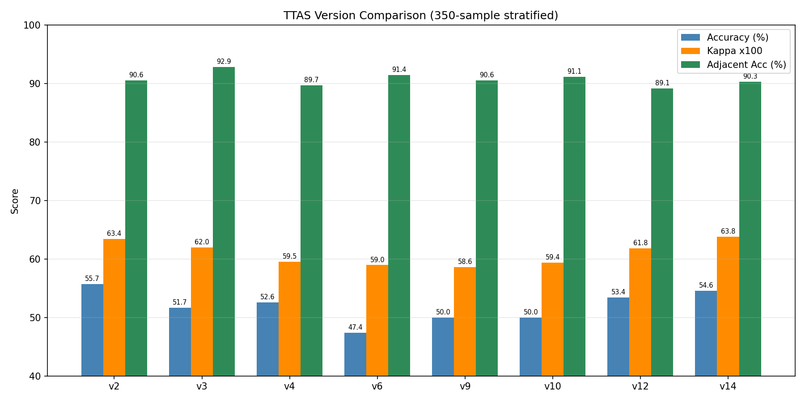

# TTAS 智慧檢傷系統 — PM 回報文件

---

## 一、疼痛資料缺失問題（50 字摘要）

> 現有資料集缺少疼痛分數（NRS 0–10）欄位，資料顯示 Lv4 有 94.6%、Lv3 有 41.8% 的案例分級主要依據是疼痛程度，導致模型 Lv3 F1=0.38、Lv4 F1=0.36 偏低。補齊此欄位預估準確率可再提升 5–10%。

---

## 二、模型現況說明（200+ 字）

### 系統架構

本系統採用 **本地 RAG + LLM 雙軌制** 架構，在不依賴雲端 API 的前提下對急診病患進行 TTAS 五級檢傷分類：

**Vital Rule-based 軌（規則引擎）**：根據病患量測的生命徵象（SpO2、GCS、SBP、MAP、HR、RR、體溫），對照官方 TTAS 成人/兒童標準，計算每項指標對應的最低緊急等級（vital_min_level）。閾值依年齡群分流，兒童心跳依月齡精確分段。

**MOI 關鍵字軌（高危受傷機轉）**：對病患主訴進行關鍵字比對，若出現槍傷、被彈出車外、頭頸軀幹穿刺傷、大量出血等高危機轉關鍵字，自動標定為至少 2 級，不依賴 LLM 語意推理。

**LLM RAG 軌（語意推理）**：先以病患主訴在 ChromaDB 向量庫（BGE-M3 嵌入，320 個主訴 chunk）執行語意檢索，再由 Qwen3-4B-Instruct（本機 GPU 量化推理）從 TTAS 判定依據清單中選出最符合的條目，抽取對應等級（含次要調節變數 Stage 2 觸發）。

**最終分級**：`final = min(vital_min_level, moi_level, llm_level)`，確保生命徵象嚴重異常或高危機轉時不因 LLM 判斷保守而被降級。

### 目前評估結果（350 筆分層抽樣，各級 70 筆）

| 指標 | v14（目前最新） | 說明 |
|---|:---:|---|
| Accuracy | **54.57%** | 嚴格完全命中率 |
| Adjacent Accuracy | **90.29%** | ｜誤差｜≤1 級（臨床可接受） |
| Linear Kappa | **0.6384** | Substantial agreement |
| Lv1 F1 | **0.867** | 急救等級偵測效果佳 |
| Lv2 F1 | **0.600** | 修正 Temp 假陽性＋MOI 偵測後改善 |
| Lv3 F1 | 0.378 | 偏低，主因疼痛資料缺失 |
| Lv4 F1 | 0.364 | 偏低，主因疼痛資料缺失 |
| Lv5 F1 | 0.500 | 中等 |

### 效能瓶頸與改善空間

1. **疼痛資料缺失（最高優先）**：TTAS Lv2–5 均有「疼痛程度×疼痛類型」作為分級依據，現有 CSV 無此欄位，Lv3/Lv4 分類準確率受到天花板限制。
2. **描述性臨床評估無法 rule-based**：「看起來有病容」、「免疫功能缺陷」、「SIRS 條件」等依賴護理師臨床觀察，目前僅能依賴 LLM 從主訴文字推斷。
3. **相鄰等級混淆**：Lv3/Lv4 邊界不清為主要誤判來源，完整疼痛資料有望改善此問題。

### 各等級疼痛案例占比（全資料集 9,653 筆）

依 TTAS 標準主訴名稱是否含「疼痛」判定（＝分級依據為疼痛程度）：

| 等級 | 總筆數 | 疼痛驅動案例 | 佔比 |
|:---:|---:|---:|:---:|
| Lv1 | 148 | 3 | 2.0% |
| Lv2 | 855 | 235 | **27.5%** |
| Lv3 | 6,849 | 2,864 | **41.8%** |
| Lv4 | 1,352 | 1,279 | **94.6%** |
| Lv5 | 449 | 425 | **94.7%** |

**Lv4 有 94.6%、Lv5 有 94.7% 的案例分級主要依據為疼痛程度**，缺少 NRS 分數時模型完全無法區分這兩級。Lv3 亦有 41.8% 依賴疼痛資料，是 Lv3/Lv4 之間混淆的根本原因。

---

## 三、版本效果比較圖

請見同目錄：`pm_report_chart.png`

> 橫軸：各開發版本；藍色柱＝Accuracy(%)；橙色柱＝Kappa×100；綠色柱＝Adjacent Accuracy(%)
